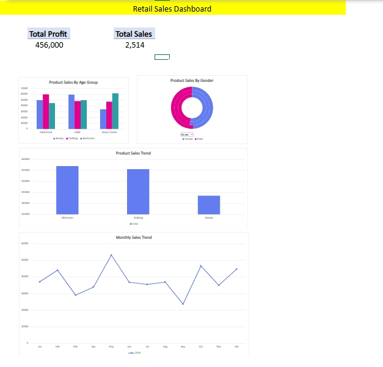

## 📷 Dashboard Preview

# 📊 Retail Sales Analysis Dashboard

## 📌 Project Overview
This project analyzes retail sales data to uncover sales trends, product category performance, and customer demographics using Microsoft Excel.

## 🧾 Dataset
- Source: Kaggle (Retail Sales Dataset)
- Records: 1000 transactions
- Categories: Clothing, Electronics, Beauty

## 🔧 Tools Used
- Microsoft Excel
- Pivot Tables
- Pivot Charts
- Dashboard Design

## 📈 Key Analysis
- Total Sales KPI
- Monthly Sales Trend
- Category-wise Sales Performance
- Customer Segmentation by Age Group and Gender

## 🧠 Key Insights
- Clothing is the highest revenue-generating category.
- Electronics shows stable demand across months.
- Beauty products have strong repeat-purchase potential.
- Adult customers contribute the most to total sales.

## 🚀 Conclusion
This dashboard helps businesses make data-driven decisions related to inventory planning, marketing strategies, and customer targeting.
